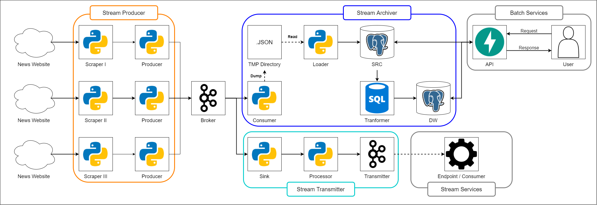

# Inquisio

## Overview
**Inquisio** is a system to extract online news and provide its processed information. **Inquisio** can provide up-to-date information in low latency. Users can get news information, such as title, category, tags, contents, and daily summaries of news information (category count, tags count). Users can also get processed streamed data from provided Pub/Sub topics.

Check out these amazing libraries and services that I used to develop this project:
1. [**BeautifullSoup**](https://github.com/waylan/beautifulsoup) with [**lxml**](https://github.com/lxml/lxml) to parse HTML page.
2. [**Request**](https://github.com/pallets/click) to retrieve website page.
3. [**SQLAlchemy**](https://www.sqlalchemy.org/) with [**psycopg2**](https://pypi.org/project/psycopg2/) to interact with PostgreSQL database using Python.
4. [**Kafka**](https://kafka.apache.org/) as Pub/Sub services to enable stream data processing.
5. [**Kafka-Python**](https://github.com/dpkp/kafka-python) to interact with Kafka using Python.
6. [**FastAPI**](https://fastapi.tiangolo.com/) to build fully documented API.

## Workflow
**Inqusio** services separated to 4 subprojects:
- [Stream Producer (Streamer)](#stream-producer)
- [Stream Archiver (Archiver)](#stream-archiver)
- [Stream Transmitter (Transmitter)](#stream-transmitter)
- [Data API (API)](#data-api)

\* Each subproject can be setup by editing each `settings.py`

Below is the diagram of **Inquisio** services:

In short:
1. `Streamer` will scraper information from online news website.
2. Scraped data will be processed and published to Kafka topics.
3. For archive data, data will be consumed by `Archiver`, dumped to JSON file and processed to `SRC` and `DW` table.
4. `API` will communicate with archived data by user request.
5. For transmit data, data will be consumed by `Transmitter`, processed and published to another Kafka topics.
6. User can subscribe to transmitter topic for real-time data.

### Stream Producer (Streamer)
`Streamer` is a cluster of web-scraping or web-crawling with data publisher services. `Streamer` will extract news information several website, category (or channel), and specific date. Currently, `Streamer` capable of extracting information from:
- [Detik](https://www.detik.com/)
- [Kompas](https://www.kompas.com/)
- [Okezone](https://www.okezone.com/)
- [Sindonews](https://www.sindonews.com/)

[Find out more! >>>]()

### Stream Archiver (Archiver)
`Archiver` is a service to batching stream data and load it to database. `Archiver` consist of two components:
- **Consumer**: subscribe topics and batch stream data into daily data.
- **Loader**: loading daily data to database for source data (SRC) and update summary data (DW).

[Find out more! >>>]()

### Stream Transmitter (Transmitter)
`Transmitter` is a service to processed stream data and publish it to another Pub/Sub topics. `Transmitter` will clean, transform, and add metadata to stream data. User can subscribe `Transmitter` topic to get real-time data.

[Find out more! >>>]()

### Data API (API)
`API` is used to get source or summary data. `API` will retrieve data from archived data, so there is no time to wait for scraper to finish their scraping process.

[Find out more! >>>]()
