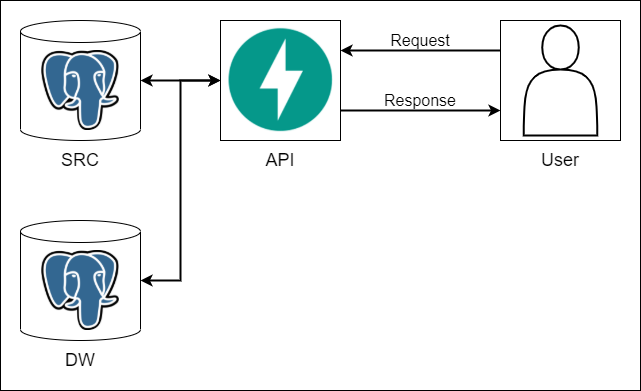

# Data API

## Overview

`API` is used to get source or summary data. `API` will only interact with archive database, especially source table (SRC) and summary table (DW). By separating web-scraping process and REST `API` process, user will get very low latency for data retrieval.



## Installation
1. Install requirements from `requirements.txt` in `Transmitter` directory.
```sh
pip install -r requirements.txt
```

2. Run `FastAPI` with `uvicorn`
```sh
uvicorn main:app --port 8000
```

## Endpoints
|Endpoints|Method|Description|
|:---|:---|:---|
|/news|GET|Get news content by query (by default will retrieve today's data from all website, category, and tags)|
|/summary/news|GET|Get summary of daily news count (by default will retrieve today's summary data)|
|/summary/tags|GET| Get summary of daily tags count (by default will retrieve today's summary data)|
