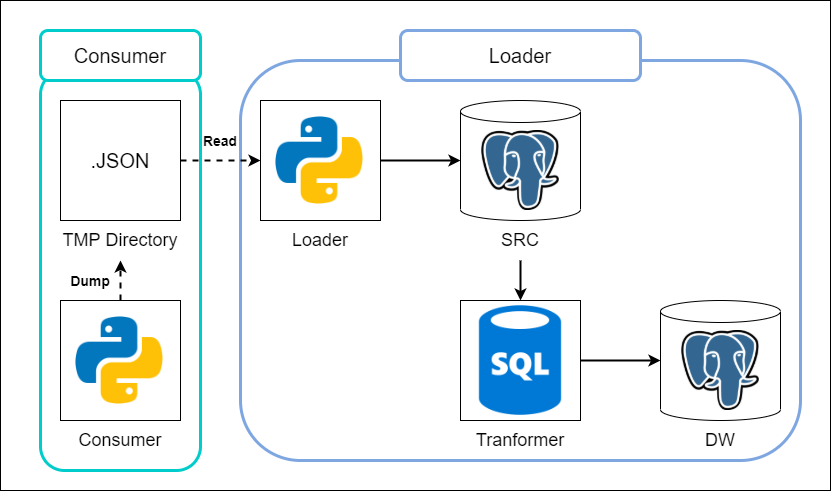

# Stream Archiver (Archiver)

## Overview
`Archiver` is a service to batching stream data and load it to database. It combining `SQLAlchemy` ORM and SQL script to create/update source and summary data. For database setup, check out [database](database/README.md).



Separated into 2 main components:

**Consumer**
<br> Its main function is to consume stream data and export it to JSON files. Consumer will batch data into one JSON file for a whole day streaming. This data will exported and archived in TMP folder.

**Loader**
<br> Its main function is to load daily data from TMP folder, processed it, load it into source table (SRC), and transform data from SRC table to create/update summary table (DW).

**Consumer** and **Loader** will work separately. **Consumer** will always active and listen Kafka topics (subscribing), but **Loader** will only run once every day. (Currently, all of this process is not scheduled).

## Installation

1. Install requirements from `requirements.txt` in `Archiver` directory.
```sh
pip install -r requirements.txt
```

2. Run `main.py` script for **Consumer** (only run once and won't stop until terminated by keyboard).
```sh
python consumer/main.py
```

3. Run `main.py` script for **Loader** (only run if batch data want to be loaded to database)
```sh
python loader/main.py
```
