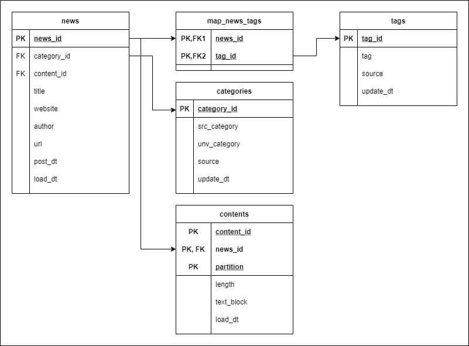
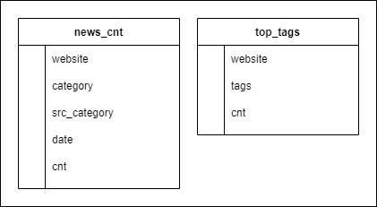

# Inquisio Database

## Auto-Builder
This module provide database instant builder for `Inquisio` project. You can run `init.ps1` file and insert your superuser username and password.

```powershell
& '.\init.ps1'
```

This `powershell` script will create `PostgreSQL` database, schema, table and admin following `Inquisio` database metadata and ERD. For simplicity reason, PK and FK constraint is not implemented in database level, but in `SQLAlchemy (ORM)` level.

## Metadata
|Meta|Value|
|:---|:---|
|Database|inquisio|
|Schema| src (for source table); dw (for summary table)|
|Owner|inq_admin|
|Password|admin|

## ERD

### Source Table (SRC)


**Description**

|Table Name|Description|
|:---|:---|
|news|News article metadata|
|categories|Categories of scraped news (with generalized category)|
contents|Partitioned contents of news|
tags|Tags of scraped news|
map_news_tags|Mapping table for news and tags|


### Summary Table (DW)


**Description**

|Table Name|Description|
|:---|:---|
|news_cnt|Count of news grouped by website and category|
|tags_cnt|Count of tags grouped by website|
