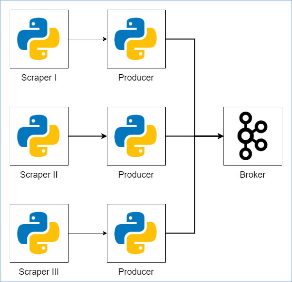

# Stream Producer (Streamer)

## Overview
`Streamer` is a cluster of web-scraping or web-crawling with data publisher services. Each website has its own scraper, and each scraper has its own publisher. Currently, every scraper is running on one process and can be setup by editing `settings.py` file.



**Scraper**
<br>
Module to scraping data from website. Scraper will start from website category index page. Scraper will navigate to each news from search by date result. Scraper will exclude some non-news article and non-text article (video or image).

**Publisher**
<br>
Module to publish scraped and processed data to Kafka (Pub/Sub) topics. Each news will be published separately (one publish will consist only one news).

This scraper is successfully work by **2021-07-30**. Some issue may occur in the future if there are changes from source websites.

## Installation
1. Install requirements from `requirements.txt` in `Streamer` directory.
```sh
pip install -r requirements.txt
```

2. Run `main.py` script.
```sh
python main.py [DATE] [MODE] # Format.
python main.py 2021-07-31 normal # Default value
python main.py 2021-07-31 debug # For debug mode
```

## Debug Mode
`Streamer` has debug mode. In debug mode, every result will also be logged to `result.json` file. The end report will also written in `report.txt`.
